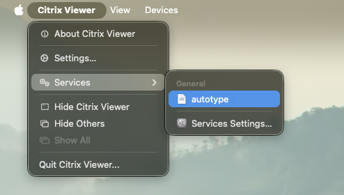

# automator-autotype

A macOS Automator Quick Action that types clipboard contents character-by-character — useful for paste-restricted fields (VDI, Citrix, locked web forms).



## Why use this?

Many remote desktop and virtual environments block `Cmd+V` paste. Tools like [Mac-AutoType](https://github.com/user/mac-autotype) solve this, but require installing a third-party application.

**automator-autotype** is different:

- **Zero install** — uses only built-in macOS Automator and AppleScript
- **No third-party apps** — nothing to download, notarize, or trust
- **MDM-friendly** — easily deployed and allowlisted via configuration profile (PPPC)

## How it works

The workflow contains a single "Run AppleScript" action that:

1. Checks the clipboard is non-empty (shows a notification if it is)
2. Displays a "Typing N characters…" notification
3. Iterates over each character and sends it as a keystroke via `System Events`
   - **Return / linefeed** → simulates the Return key
   - **Tab** → simulates the Tab key
   - **Printable ASCII** (32–126) → typed directly via `keystroke`
   - **Non-ASCII / Unicode** (emoji, accented chars, etc.) → pasted individually via clipboard fallback
4. Restores the original clipboard contents when done
5. Displays a "Done" notification

## Installation

1. **Clone or download** this repository
2. **Copy the workflow** to your Services folder:
   ```bash
   cp -R autotype.workflow ~/Library/Services/
   ```
3. **Grant Accessibility permission** — the first time you run it, macOS will prompt you to allow Automator (or the host app) in **System Settings → Privacy & Security → Accessibility**. Click "Allow".

### Corporate / MDM deployment

For managed Macs, IT can pre-approve the Accessibility permission via a PPPC (Privacy Preferences Policy Control) configuration profile targeting `com.apple.automator.runner` (or the relevant bundle ID of the calling application).

### Optional: keyboard shortcut

You can optionally assign a shortcut in **System Settings → Keyboard → Keyboard Shortcuts → Services** — find **autotype** under **General**. Note that keyboard shortcuts for Services don't always work reliably in all apps.

## Usage

1. Copy text to the clipboard as usual (`Cmd+C`)
2. Click into the paste-restricted field
3. Trigger autotype via **App menu → Services → autotype**

## Compatibility

Works with paste-restricted environments including:

- **Citrix Workspace** / Citrix Virtual Apps and Desktops
- **VMware Horizon** (View Client)
- **Microsoft Remote Desktop** (RDP)
- **AWS WorkSpaces**
- **Parallels RAS**
- **Browser-based VDI** (e.g. Apache Guacamole, Amazon AppStream)
- **Paste-disabled web forms** (banking portals, exam platforms, corporate intranets)

If a field blocks `Cmd+V`, autotype can bypass it by simulating individual keystrokes.

## License

[MIT](LICENSE)
